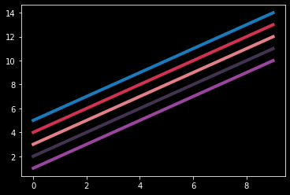
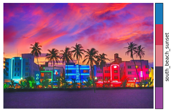
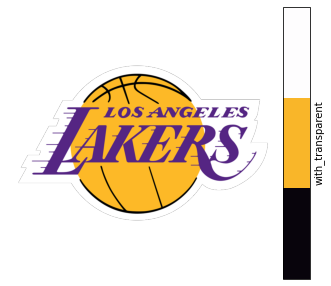
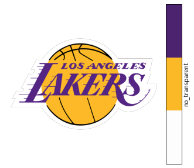

========
img2cmap
========

Usage
=====

Basic
-----

**Create colormaps from images in three lines of code!**

| First, ``ImageConverter`` class converts images to arrays of RGB values.
| Then, ``generate_cmap`` creates a matplotlib `ListedColormap <https://matplotlib.org/stable/api/_as_gen/matplotlib.colors.ListedColormap.html#matplotlib-colors-listedcolormap>`_.

.. code-block:: python3

    from img2cmap import ImageConverter

    # Can be a local file or URL
    converter = ImageConverter("tests/images/south_beach_sunset.jpg")
    cmap = converter.generate_cmap(n_colors=5, palette_name="south_beach_sunset", random_state=42)

Now, use the colormap in your plots!

.. code-block:: python3

    import matplotlib.pyplot as plt

    colors = cmap.colors

    with plt.style.context("dark_background"):
        for i, color in enumerate(colors):
            plt.plot(range(10), [_+i+1 for _ in range(10)], color=color, linewidth=4)

Plot the image and a colorbar side by side.

.. code-block:: python3

    import matplotlib.pyplot as plt
    from mpl_toolkits.axes_grid1 import make_axes_locatable

    fig, ax = plt.subplots(figsize=(7, 5))

    ax.axis("off")
    img = plt.imread("tests/images/south_beach_sunset.jpg")
    im = ax.imshow(img, cmap=cmap)

    divider = make_axes_locatable(ax)
    cax = divider.append_axes("right", size="10%", pad=0.05)

    cb = fig.colorbar(im, cax=cax, orientation="vertical", label=cmap.name)
    cb.set_ticks([])

Advanced
--------

generate_optimal_cmap
^^^^^^^^^^^^^^^^^^^^^

You can extract the optimal number of colors from the image using the ``generate_optimal_cmap`` method.
Under the hood this performs the `elbow method <https://en.wikipedia.org/wiki/Elbow_method_(clustering)>`
to determine the optimal number of clusters based on the sum of the squared distances between each pixel
and it's cluster center.

.. code-block:: python3

    cmaps, best_n_colors, ssd = converter.generate_optimal_cmap(max_colors=10, random_state=42)

    best_cmap = cmaps[best_n_colors]

remove_transparency
^^^^^^^^^^^^^^^^^^^

In an image of the Los Angeles Lakers logo, the background is transparent. These pixels
contribute to noise when generating the colors. Setting ``remove_transparency`` to ``True``
will remove transparent pixels. Here's a comparison of the colormaps generated by the same image,
without and with transparency removed.

Make two ImageConverter objects:

.. code-block:: python3

    from img2cmap import ImageConverter

    image_url = "https://loodibee.com/wp-content/uploads/nba-los-angeles-lakers-logo.png"

    # Create two ImageConverters, one with transparency removed and one without
    converter_with_transparent = ImageConverter(image_url, remove_transparent=False)
    converter_no_transparent = ImageConverter(image_url, remove_transparent=True)

    cmap_with_transparent = converter_with_transparent.generate_cmap(
        n_colors=3, palette_name="with_transparent", random_state=42
    )
    cmap_no_transparent = converter_no_transparent.generate_cmap(
        n_colors=3, palette_name="no_transparent", random_state=42
    )

Plot both colormaps with the image:

.. code-block:: python3

    import matplotlib.pyplot as plt
    from mpl_toolkits.axes_grid1 import make_axes_locatable

    for cmap in [cmap_with_transparent, cmap_no_transparent]:
        fig, ax = plt.subplots(figsize=(7, 5))

        ax.axis("off")
        img = converter_no_transparent.image
        im = ax.imshow(img, cmap=cmap)

        divider = make_axes_locatable(ax)
        cax = divider.append_axes("right", size="10%", pad=0.05)

        cb = fig.colorbar(im, cax=cax, orientation="vertical", label=cmap.name)
        cb.set_ticks([])

Notice, only after removing the transparent pixels, does the classic purple and gold show in the colormap.

resize
^^^^^^

There is a method of the ImageConverter class to resize images. It will preserve the aspect ratio, but reduce the size
of the image.

.. code-block:: python3

    def test_resize():
        imageconverter = ImageConverter("tests/images/south_beach_sunset.jpg")
        imageconverter.resize(size=(512, 512))
        # preserves aspect ratio
        assert imageconverter.image.size == (512, 361)

Installation
============

::

    pip install img2cmap

You can also install the in-development version with::

    pip install https://github.com/arvkevi/img2cmap/archive/main.zip

Documentation
=============

https://img2cmap.readthedocs.io/

Status
======

.. start-badges

.. list-table::
    :stub-columns: 1

    * - docs
      - |docs|
    * - tests
      - | |github-actions|
        | |codecov|
    * - package
      - | |version| |wheel| |supported-versions| |supported-implementations|
.. |docs| image:: https://readthedocs.org/projects/img2cmap/badge/?style=flat
    :target: https://img2cmap.readthedocs.io/
    :alt: Documentation Status

.. |github-actions| image:: https://github.com/arvkevi/img2cmap/actions/workflows/github-actions.yml/badge.svg
    :alt: GitHub Actions Build Status
    :target: https://github.com/arvkevi/img2cmap/actions

.. |codecov| image:: https://codecov.io/gh/arvkevi/img2cmap/branch/main/graphs/badge.svg?branch=main
    :alt: Coverage Status
    :target: https://codecov.io/github/arvkevi/img2cmap

.. |version| image:: https://img.shields.io/pypi/v/img2cmap.svg
    :alt: PyPI Package latest release
    :target: https://pypi.org/project/img2cmap

.. |wheel| image:: https://img.shields.io/pypi/wheel/img2cmap.svg
    :alt: PyPI Wheel
    :target: https://pypi.org/project/img2cmap

.. |supported-versions| image:: https://img.shields.io/pypi/pyversions/img2cmap.svg
    :alt: Supported versions
    :target: https://pypi.org/project/img2cmap

.. |supported-implementations| image:: https://img.shields.io/pypi/implementation/img2cmap.svg
    :alt: Supported implementations
    :target: https://pypi.org/project/img2cmap

.. end-badges

Development
===========

To run all the tests run::

    tox

Note, to combine the coverage data from all the tox environments run:

.. list-table::
    :widths: 10 90
    :stub-columns: 1

    - - Windows
      - ::

            set PYTEST_ADDOPTS=--cov-append
            tox

    - - Other
      - ::

            PYTEST_ADDOPTS=--cov-append tox
